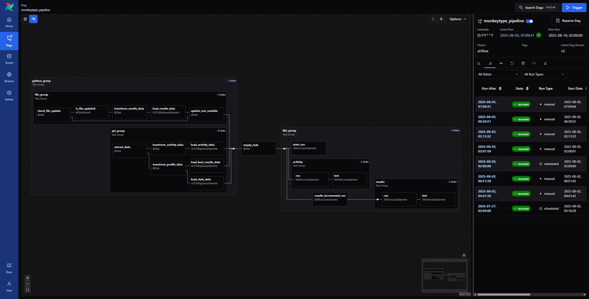
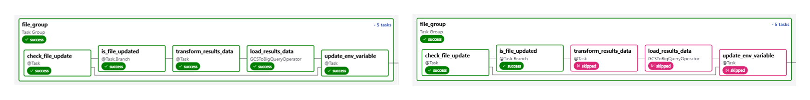
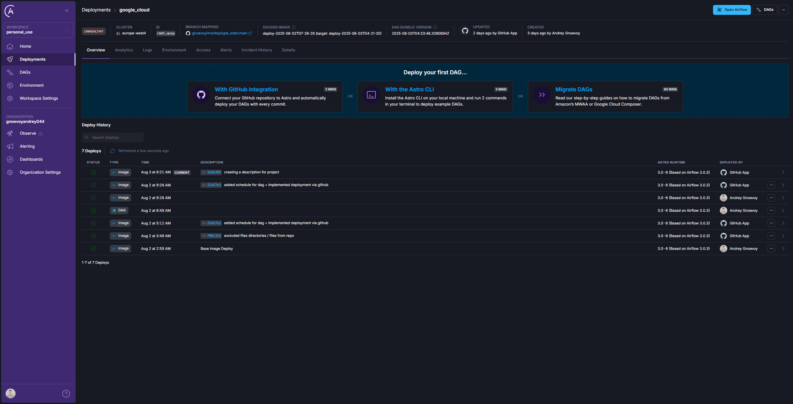
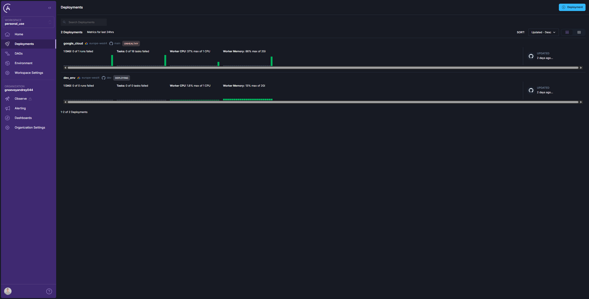

# Project Overview

**Objective:** Get familiar with Airflow by building a data pipeline that delivers an analytics-ready dataset in BigQuery. The pipeline is deployed in Astronomer Cloud and automatically updated on new commits from the Git repo.

**Data Source:** Typing stats from the Monkeytype API, along with a manually maintained tests history file.

**Used Tools:** `Airflow`, `Python`, `SQL`, `dbt`, `Docker`, `Git`, `Astronomer`, `BigQuery`, `Google Cloud Storage`

**Result:** Airflow DAG automatically deployed to Astronomer Cloud and scheduled to run regularly.

 

## Airflow DAG

### Used Features:

- Configured the DAG to run on a weekly schedule using `@weekly` option
- Used groups with the `@task_group` decorator to separate logic  
- Configured `connections` in the Astronomer UI to authenticate with Google Cloud  
- Used `.env` file locally and environment variables in the cloud via Astronomer UI  
- Leveraged Google Cloud `hooks` and `operators` to:
   - Read and write data to a Google Cloud Storage bucket  
   - Transfer data between the bucket and BigQuery  
- Used `requests` and `pandas` to retrieve and transform data  
- Applied conditional logic with:
   - Task skipping if the file in the bucket has not changed  
   - Update values by passing variables between tasks using `XComs`  
   
- Added an `EmptyOperator` to connect Python and dbt groups in the DAG chain  
- Integrated `dbt` using the `Cosmos` module to:
   - Display dbt project structure in the Airflow UI  
   - Run models as part of the DAG   

 

## Deployment

Astronomer was chosen for its easy setup and powerful CLI, which simplify local development and streamline the deployment of Airflow to the cloud.

In this project was used both dev and production deployments to separate environments, configured a connection to Google Cloud for authentication, and added environment variables to securely manage sensitive data. The DAG is automatically deployed to Astronomer Cloud on new commits through a connected GitHub repository.

