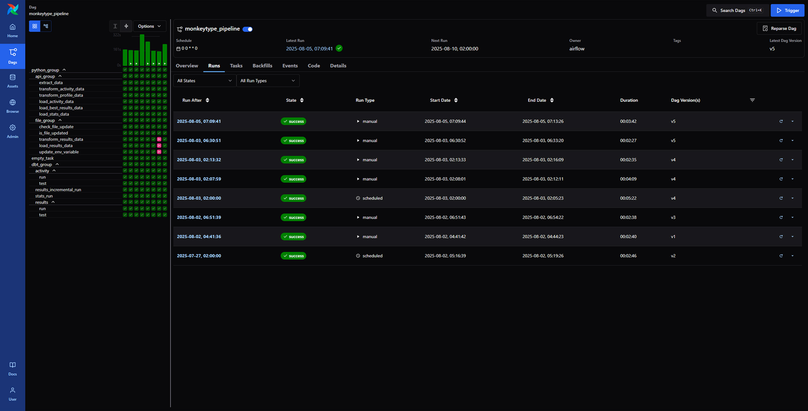

# Project Overview

**Objective:** Get familiar with Airflow by building a data pipeline that delivers an analytics-ready dataset in BigQuery. The pipeline is deployed, scheduled, and automated in Astronomer Cloud.

**Data Source:** Typing stats from the Monkeytype API, along with a manually maintained test history file stored in a Google Cloud bucket.

**Used Tools:** `Airflow`, `Python`, `SQL`, `dbt`, `Docker`, `Git`, `Astronomer`, `BigQuery`, `Google Cloud Storage`

**Result:** Airflow DAG deployed to Astronomer Cloud, running on a schedule and regularly updating a dataset in BigQuery.

<!--  -->

 

Project Overview

Objective
build data pipeline with the help of Airflow, deploy on Cloud , run code on schedule -> explore airlow capabilties and features 

Data Source
Monkeytype API with user typing stats + manually updated file in the google bucket

Tools
Airflow, python, dbt, sql, docker, git, astro, bigquery, google bucket

Results
Deployed airflow dag to astronomer cloud with scheduling 
> image of airflow dag (screenshot)

Regualrly updated dataset in BigQuery with user stats
> image of dataset schema

----------------------------------------------------

Airflow

> image of dag structure

Used features
1. used groups to separate logic for different tools and inner logic 
2. 

---------------

airflow:
- set up a scheduler
- grouping tasks into sections
- chaining together tasks
- establish connection, use env variables + airflow variables from db
- use cosmos dbt 
- use astro instead of docker compose with basic airflow images
- using operators for different services (dbt cosmos, bigquery, bucket)

python code:
- request for getting data from api
- pandas for data transformations 

deployment:
- astro via github integration
--------------

Deployment